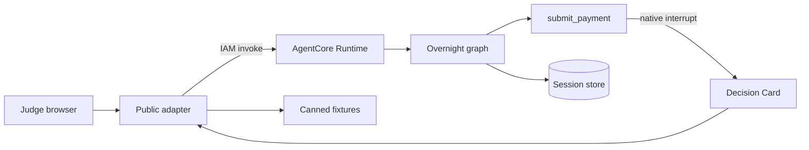
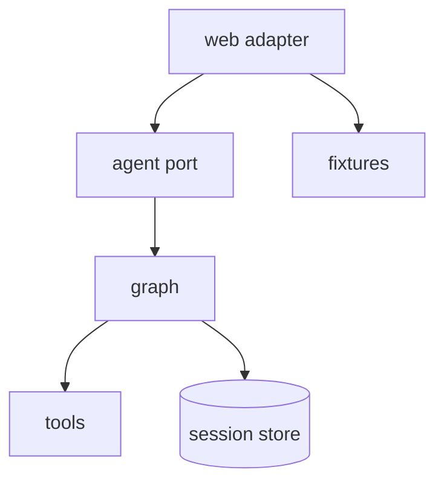

# Hold architecture

Public `/` is a FastAPI page. The browser never calls AgentCore; the adapter holds IAM and invokes the Runtime. Overnight work is a sequential graph (ingest → classify → pay), and the judged pause is a native interrupt on the payment tool.

- Deny runs `cancel_tool` on `submit_payment`. Graph `cancel_node` is unused.
- Trust writes supplier `cedar-supply`. The current $412 still needs Approve.
- GET `/` restores a persisted interrupt and does not start overnight work.
- Canned Path is an HTTP fixture (`?fixture=overnight` or a live-fetch failure), labeled CANNED PATH.
